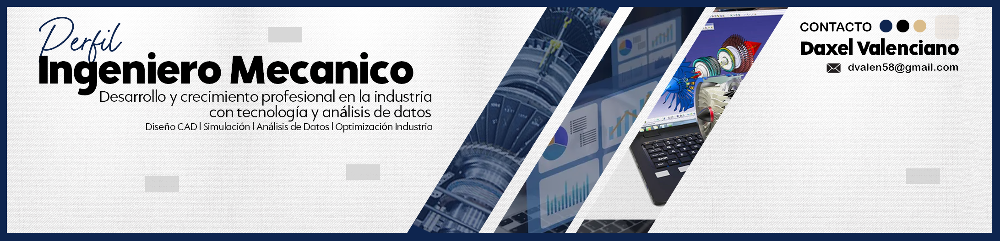

<h1 align="center">¡Hola, soy Daxel! 👋</h1>

Ingeniero mecánico | Diseñador | Analista de Datos | Emprendimiento <b>Moops</b>  

  

### ¿Quién soy?

Soy **Daxel**, ingeniero mecánico con pasión por el diseño, los datos y el emprendimiento.  
Fundador de [Moops], un negocio donde diseño y vendo productos personalizados como fundas, playeras y cuadros.  
Amante de la música, el diseño, y con grandes sueños por cumplir.

---

### Motivaciones
- Transformar ideas en diseños que conectan
- Analizar datos para tomar mejores decisiones
- Aprender cosas nuevas (todo el tiempo)
- Ayudar a otros a crecer
- Y claro... ¡la música! (toco guitarra y compongo cuando nadie me ve)

---

### Proyectos en los que estoy trabajando:

- 🚀 **Moops**: tienda de diseño personalizado con enfoque en tendencias visuales.
- 📊 **Dashboards & Data Viz**: gráficos interactivos en Python con Plotly y Dash.
- 🎬 **Contenido creativo en TikTok** sobre diseño, estilo y productividad.
- 🧠 **Diseños mecanicos en CAD** Dibujo asistido por computadora, de piezas mecanicas.

---

### Tecnologías que manejo:

- **Diseño**: Canva, Illustrator, Photoshop, Procreate
- **Programación**: Python, Pandas, SQL, Matplotlib
- **Análisis de Datos**: Pandas, Numpy, Matplotlib, Excel
- **Otros**: Git, VS Code, Notion, Figma, iMovie, CapCut
- **Video & edición**: CapCut, iMovie, After Effects
- **Organización**: Notion, Trello, Google Calendar

---
###

  
  
  

###

###

  
  
  
  
  
  
  
  
  
  
  
  
  
  
  
  
  
  
  
  
  
  
  
  
  

###

  
  
  
  
  

###

 

###

### Conecta conmigo:

- 💼 [Instagram - @daxelval](https://instagram.com/daxelval)
- 🎨 [TikTok - @moopsdiamore](https://tiktok.com/@moopsdiamore)
- ✉️ moops.contacto@gmail.com

---

> “No es necesario que sepas de dónde viene la luz, solo que está ahí para recordarte lo especial que eres.”  
> — Yo

---

 <!-- Aquí puedes poner tu propio logo o imagen de marca -->
